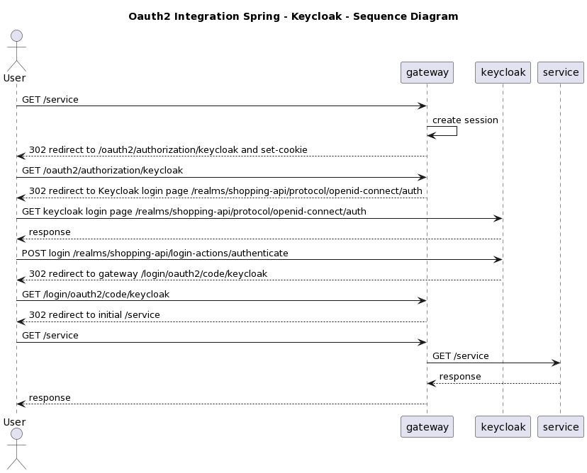

# Identity

Technical detail on how the keycloak works with Spring. Documentation how to run the local Keycloak is defined on the repository itself [here](https://github.com/groot-mg/identity-service)

## Login with Keycloak

For Authentication and Authorization, an Spring OAuth2 is used with Keycloak. The sequence diagram below shows what happen when an unauthenticated user tries to access a specific resource.

1. First the user sends a request to the gateway
1.2. Gateway checks a session does not exists and returns a 302 to /oauth2/authorization/keycloak
2. Again the gateway returns a 302 but now redirects the request to keycloak login
3. Users login successfully and Keycloak redirects the request to the gateway
3.1 Gateway saves the session and user session details on keycloak, including the JWT Access Token (this token is used by the gateway to redirect requests to the final downstreams)
3.2 Returns 302 with a redirect to the initial request 
4. Request the Gateway again, and now logged in, access successfully the resource

