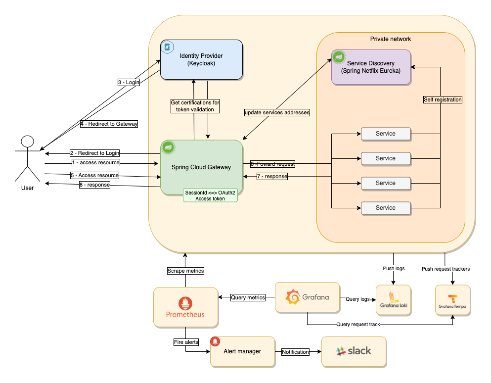
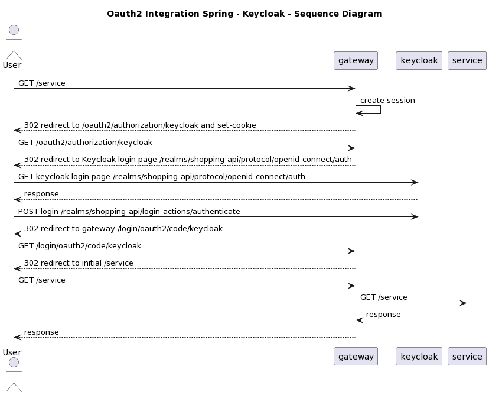
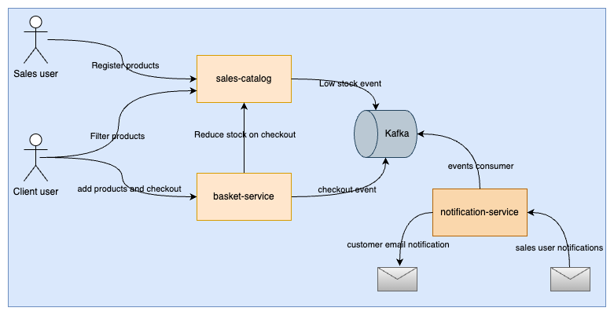

# Documentation

This repo is used to keep diagrams, designs and documentation about the project. 

---

## Draw.io
[draw.io](http://draw.io/) is used for the designs.

Files are available under the folder [/draw.io](./draw.io/).

## PlantText

[PlantText](https://www.planttext.com/) is used for the sequence diagrams.

Files are available under the folder [/plant-text](./plant-text/).

# Application architecture/design

The application uses a gateway as entry point and Oauth2 integration. Keycload is the Identity Service responsible to keep users data and provvide the access token to be used on the resource servers.

List of frameworks and tools used on the applications:

- [Keycloak](https://www.keycloak.org/)
- [Spring Cloud Gateway](https://spring.io/projects/spring-cloud-gateway)
- [Spring Cloud Netflix Eureka](https://spring.io/projects/spring-cloud-netflix)
- [Spring Security Oauth2](https://spring.io/projects/spring-security-oauth)
- [Prometheus](https://prometheus.io/)
- [Alert Manager](https://prometheus.io/docs/alerting/latest/alertmanager/#alertmanager)
- [Slack](https://slack.com/intl/en-gb)
- [Micrometer](https://micrometer.io/)
- [Grafana Tempo](https://grafana.com/oss/tempo/)
- [Grafana Loki](https://grafana.com/oss/loki/)
- [Grafana](https://grafana.com/)

And below the Design how all the frameworks and tools integrate each other:

# Respositories 

What each repository does:

* `docs (this repository)`: contains documentation
* `docker-local-setup`: contains docker config to run all the services together on a local environment
    * Repository: [docker-local-setup](https://github.com/groot-mg/docker-local-setup)
* `insomnia-requests`: contains a backup for the insomnia requests
    * Repository: [insomnia-requests](https://github.com/groot-mg/insomnia-requests)
* `observability-tools`: contains config for prometheus, alert-manager, grafana, tempo and fluent-bit.
    * Repository: [observability-tools](https://github.com/groot-mg/observability-tools)
* `local-database-config`: contains centralised config for database
    * Repository: [local-database-config](https://github.com/groot-mg/local-database-config)
* `local-kafka-config`: contains centralised config for kafka
    * Repository: [local-kafka-config](https://github.com/groot-mg/local-kafka-config)
* `service-discovery`: service discovery app (Netflix eureka)
    * Repository: [service-discovery](https://github.com/groot-mg/service-discovery)
* `gateway`: gateway app, the application entrypoint. 
    * Repository: [gateway](https://github.com/groot-mg/gateway)
* `identity-service`: contains keycloak config (and an application that is not used in the project, but can be used to login and create new users)
    * Repository: [identity-service](https://github.com/groot-mg/identity-service)
    * Wiki: [here](https://github.com/groot-mg/identity-service/wiki)
* `sales-catalog`: manage products and stock
    * Repository: [sales-catalog](https://github.com/groot-mg/sales-catalog)
* `basket-service`: manage the client basket
    * Repository: [basket-service](https://github.com/groot-mg/basket-service)
* `notification-service`: kafka consumer for notifications, but this has no implementation
    * Repository: [notification-service](https://github.com/groot-mg/notification-service)

# Requirements / Features

## High Level

The project is an simple e-commerce that manages products and allow customers to buy them. It provides a whole monitoring architecture with Prometheus, Grafana dashboards and logging tracing, also including an alerting system with alert-manager integrated with Slack. 

In deep details are provided on the next topics, but a summary on the main features are:
* Sale and customer users are allowed, some features on the application are limited to specific users
* Sale users will register, update, delete, active or deactivate products
* Customers are able to retrieve all the active products and buy them
* Validations are included during product registration, update, delete, on user interation with basket
* A reservation system is implemented to avoid 2 different customers to buy the last product in stock
* On checkout, Kafka messages are created to notify the seller, the customer, and to create a tracking record to delivery the order, but there is no implementation on those features besides reading and logging the message

### What is not included on this project
This is not intended to be a complex or a full e-commerce implementation, so the features below are not included:
* Sending real e-mail/SMS or other type of notifications
    * `notification` repository contains a kafka consumer to consume notifications (kafka message) but it just logs on the console and does not have much implementation
* Tracking system (Delivery)
    * `notification` repository contains a kafka consumer to consume messages when the user checks out a basket, but there is not tracking system implementation for the delivery (shipping, dispatched, delivered, etc), it just logs on the console
* Discount cupom or promotions, or delivery calculation
    * Discounts, promotions or delivery calculation are not included on this project during check out
* Multiple currencies (Dolar, Euro, Real, etc)
    * There is no support for multiple currencies
* Multi language
    * product names or desriptions could have support for more than one language, but it is not set on this project
* Payments
    * This project does not implement any payment flow

## Users
Users will have 2 different roles: 

- `Sale`: user that is able to register products and see its sales
- `Client`: user that is able to purchase products 

`p.s`: The users are created directly on keycloak.

### Login with Keycloak

For Authentication and Authorization, an Spring OAuth2 is used with Keycloak. The sequence diagram below shows what happen when an unauthenticated user tries to access a specific resource.

1. First the user sends a request to the gateway
1.2. Gateway checks a session does not exists and returns a 302 to /oauth2/authorization/keycloak
2. Again the gateway returns a 302 but now redirects the request to keycloak login
3. Users login successfully and Keycloak redirects the request to the gateway
3.1 Gateway saves the session and user session details on keycloak, including the JWT Access Token (this token is used by the gateway to redirect requests to the final downstreams)
3.2 Returns 302 with a redirect to the initial request 
4. Request the Gateway again, and now logged in, access successfully the resource

## Services

The diagram above is high level about the features and the communications between the services:

### Sales catalog

* A sales user register/update/delete products
* Products in basket or purchased are not allowed to be deleted
    * a field on database `reserved` will increment when a product is reserved in basket
    * if the product is removed from all basked it will be back to `0` and allowed to be deleted
    * another flag 'is_sold' will be set to true is a sale is finished with the product, after this, it will be disallowed to be deleted forever (in a real scenario the product would be in the invoice)
* Any product are allowed to be deactivated
* Clients are allowed to list all active products
* When the stock is low or sold out, a notification should be sent to the seller

#### Endpoints:
* Add product (POST /products)
    * Role: sale
    * Validations: 
        * name duplication
        * price should be positive
        * quantity should be zero or positive
* Update product (PATCH /product/{product_id})
    * Role: sale
    * same validations as to add product
    * Increment stock or decrement stock
* Delete product (DELETE /products/{product_id})
    * Validations:
        * products in basket are not allowed to be deleted
        * products purchased are not allowed to be deleted
* Disable product (PUT /products/{product_id}/activate, PUT /products/{product_id}/deactivate)
* List products (GET /products)
    * If sales user - list all owned products
        * Does not list products from other users
    * If client, list all active products in stock
* Get specific product (GET /products/{product_id})
    * Same validation on the user type as to return all products
* GET products by ids (GET /products?ids={ids})
    * This will be used by basket service to verify if products exist in a single call
    * The response when a product does not exist will be an error with details on body

Database: PostgreSQL

* product:
    * product_id
    * name
    * description
    * price
    * quantity
    * reserved
    * is_sold
    * user_id (sale user)

### Basket service

* Only client users are allowed to interact with basket endpoints
* When a product has its price changed and a product is already on the basket, the previous price will be still used
* A basket will have 15 minutes life (in a real project it would be longer)
    * When a basket is created, a Kafka message should be created to be triggered 15 minutes later
    * A consumer job will check the basket status, and if it is not closed, it should expire the basket and remove the product as reserved

Endpoints:
* Create basket (POST /baskets)
    * Validations
        * Check if user has already an open basket
        * Should have at least one product
        * Check if products exist on `sales_catalog`
        * Call `sales_catalog` to reserve the product
    * Create a kafka message for basket expiration in 15 minutes
* Add product to the basket (POST /baskets/{basket_id}/products)
    * Allow maximun 10 products in the basket
    * Call `sales_catalog` and check if product exist
    * Call `sales_catalog` to reserve the product
* Update product quantity (PUT /baskets/{basket_id}/products/{products_id})
    * Check `sales_catalog` if the product exist
    * Reserve product on `sales_catalog`
    * If the update set it to 0, remove the product from the basket
    * Basket should have at least 1 product, so need validation
* Delete product from basket (DELETE /baskets/{basket_id}/products/{product_id})
    * Basket should have at least one product
* List all baskets (GET /baskets)
* List by id (GET /baskets/{basket_id})
* Checkout (POST /baskets/{basket_id}/checkout)
    * call `sales_catalog` and update stock/reserved product
    * update basket status to CLOSED
    * create kafka messages for:
        * user notification - sale completed
        * notification for each sale user about the product(s) sold

* Kafka consumer
    * Consumer message for basket expiration
    * If basket is not CLOSED, update status to EXPIRED
        * Calls `sales_catalog` and put he product in the stock again

Database: PostgreSQL

* basket:
    * basket_id
    * user_id (client user)
    * total_preview
    * status (active, closed, expired)

* basket_items:
    * basket_id
    * product_id
    * product_price

### Notification service

* Notification service will have the default `/info`, `/health` and `/metrics` endpoints from actuator
* It is a kafka listener
* A message will be listened when a customer closes a basket
* A notification should be sent (fake) to the customer and to the seler